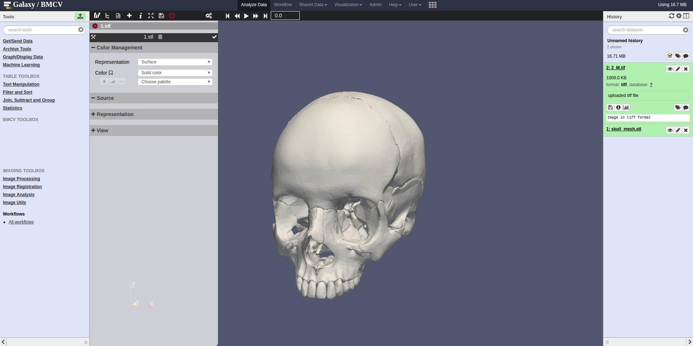

[](https://travis-ci.org/BMCV/docker-paraviewweb)
[](https://hub.docker.com/r/bmcv/galaxy-paraviewweb/) 
[](https://hub.docker.com/r/bmcv/galaxy-paraviewweb/) 

Docker ParaViewWeb Container
========================


This [ParaViewWeb](http://paraviewweb.kitware.com/) Docker container is used by the [Galaxy Project](https://galaxyproject.org/).



Usage
=====

* Build your own image and run it

 [Docker](https://www.docker.com) is a pre-requirement for this project. You can build the container with:
 ```bash
  docker build -t paraviewweb .
 ```
 The build process can take some time, but if finished you can run your container with:
 ```bash
  docker run -p 8777:8777 -v /home/user/paraviewweb/input/:/input/ -v /home/user/paraviewweb/output/:/output/ paraviewweb
 ```
 and you will have a running [ParaViewWeb](http://paraviewweb.kitware.com/) instance on ``http://localhost:8777/apps/Visualizer``.

 Environment Variables
 =====================

 Some environment variables are made available to the user which will allow for configuring the behaviour of individual instances.

 Variable            | Use
 ------------------- | ---
 `DATASET_HID`           | Path of file relative to /input which is loaded on startup

Acknowledgment
========================
This work was supported by the BMBF-funded Heidelberg Center for Human Bioinformatics (HD-HuB) within the German Network for Bioinformatics Infrastructure (de.NBI) #031A537C.

Works best with
=====================

 * [Galaxy Image Analysis Tools](https://github.com/ThomasWollmann/galaxy-image-analysis)
 * [Galaxy Imaging](https://github.com/bgruening/docker-galaxy-imaging)
