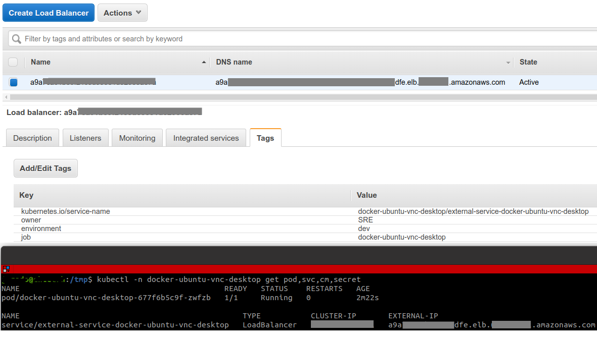

# Kubernetes deployment for ubuntu-desktop-lxde-vnc 

### Info
This is usefull when you need a "virtual machine" into your cluster, to work or play with another pods.
The deploy some env vars to customize your data (user and passwords) and has a configmpa where you can configure you supervisord conf. 

### How to deploy
    kubectl apply -f k8s-deployment.yaml

### Output
    namespace/docker-ubuntu-vnc-desktop created
    service/external-service-docker-ubuntu-vnc-desktop created
    service/internal-service-docker-ubuntu-vnc-desktop created
    configmap/supervisord-config-file created
    secret/secrets-docker-ubuntu-vnc-desktop created
    deployment.apps/docker-ubuntu-vnc-desktop created

  
  
### Show deployment
    kubectl -n docker-desktop-app get pod,svc,cm

    NAME                                      READY   STATUS    RESTARTS   AGE
    pod/docker-desktop-app-575fcb7994-ccmtt   1/1     Running   0          95m

    NAME                                          TYPE           CLUSTER-IP       EXTERNAL-IP                         PORT(S)          AGE
    service/external-service-docker-desktop-app   LoadBalancer   10.10.10.10     xxxxx.elb.aws-region.amazonaws.com   6080:31627/TCP   95m
    service/internal-service-docker-desktop-app   ClusterIP      11.11.11.11     <none>                               6080/TCP         95m

    NAME                                DATA   AGE
    configmap/supervisord-config-file   1      95m

    NAME                                       TYPE                                  DATA   AGE
    secret/secrets-docker-ubuntu-vnc-desktop   Opaque                                2      95m

 

	

### ToDo
    Helm chart (pending...)
